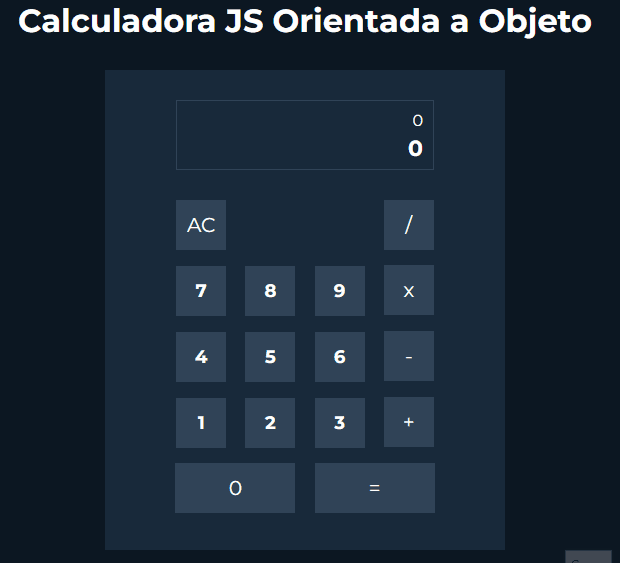

Calculadora feita no curso de Programação orientada a objeto com JavaScript da Udemy, Hora de Codar.

## 🧪 Tecnologia

- [JavaScript](https://javascript.org/)
- [HTML](https://html.org/)
- [CSS](https://css.org/)

---

Made with ♥ by Ayrton Costa

